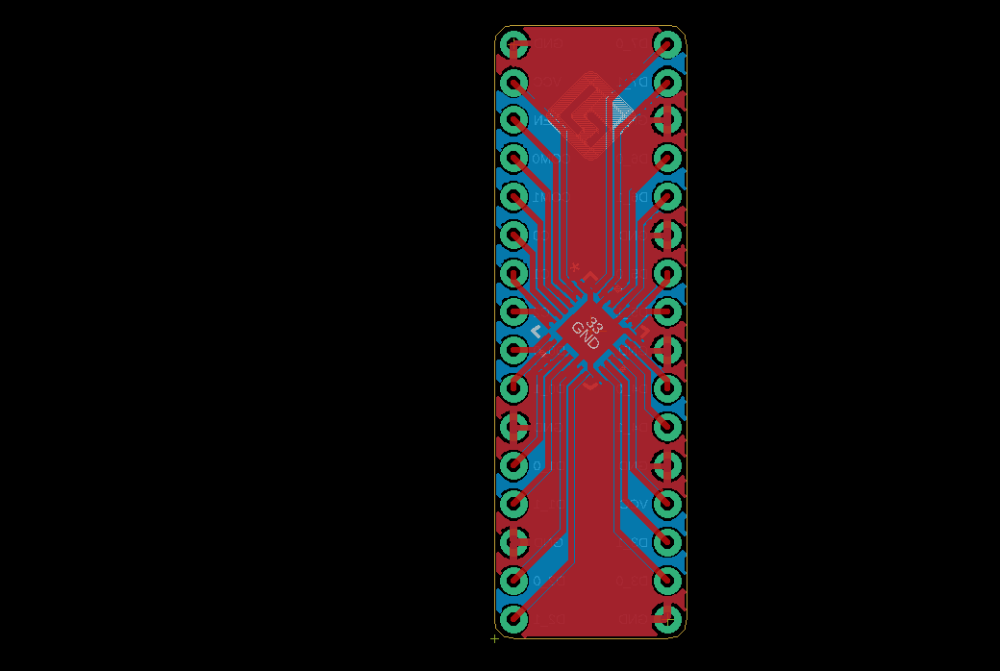
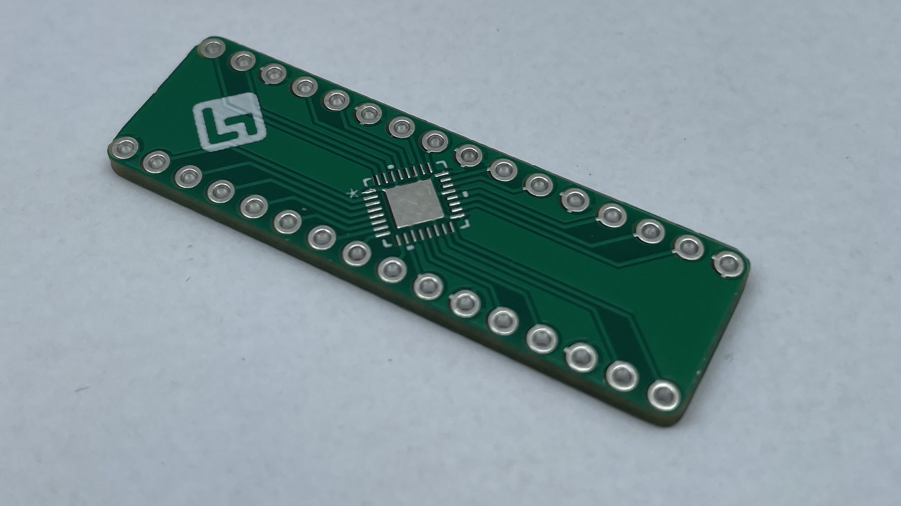
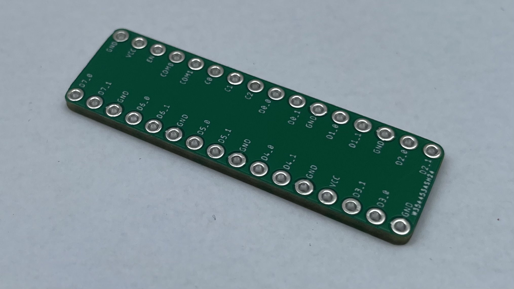
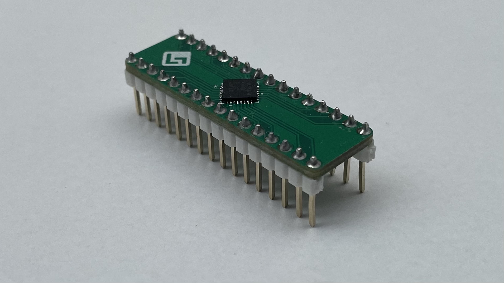
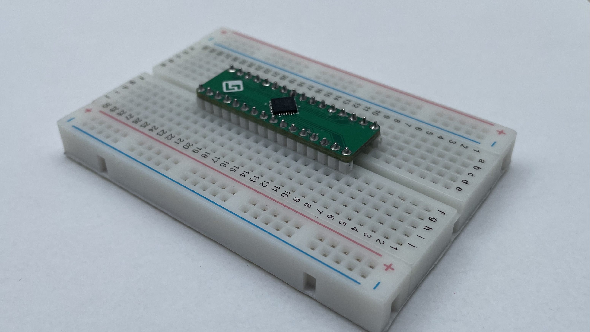

# MAX4999 breakout board

EAGLE schematics for the [MAX4999](https://www.maximintegrated.com/en/products/analog/analog-switches-multiplexers/MAX4999.html) breakout board. The MAX4999 is an USB 2.0 Hi-Speed multiplexer using a TQFN-32 (QFN-32) package.

The breakout board exposes all the 32 pins of the MAX4999. The breakout pins are 2.54mm (0.1") apart from each other with 16 pins on each side. It fits on a standard breadboard for prototyping.

Top and bottom of printed board.

Assembled board with the MAX4999.

